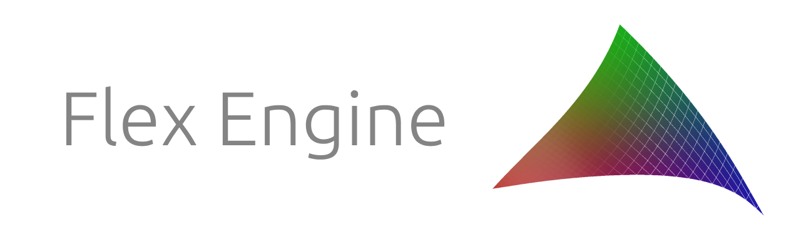

Flex Engine is a personal game engine I began work on in February 2017. I use it as a playground for learning about real-time techniques. I try to keep [master](https://github.com/ajweeks/FlexEngine/tree/master) reasonably stable, and therefore update it infrequently. See [development](https://github.com/ajweeks/FlexEngine/tree/development) for the latest changes.

#### Notable Features
- Vulkan backend
- Conditional checksum-based shader compilation
- Support for Windows & linux
- Scene editor with serialization
- In-game scripting language & virtual machine
- Built-in profiling capture/inspection tools
- Rendering:
	- Physically based shading model
	- Image based lighting
	- Screen-space ambient occlusion
	- Stable cascaded shadow mapping
	- Temporal anti-aliasing
	- Signed-distance field font generation & rendering
	- GPU particles
	- Terrain, ocean, and sky rendering

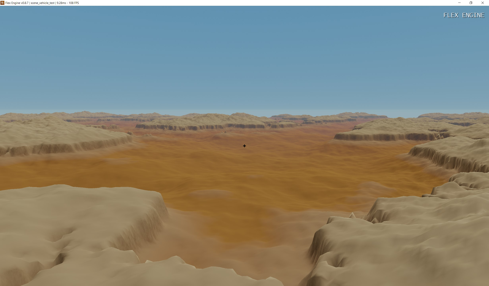
**Procedural terrain generated on the GPU**

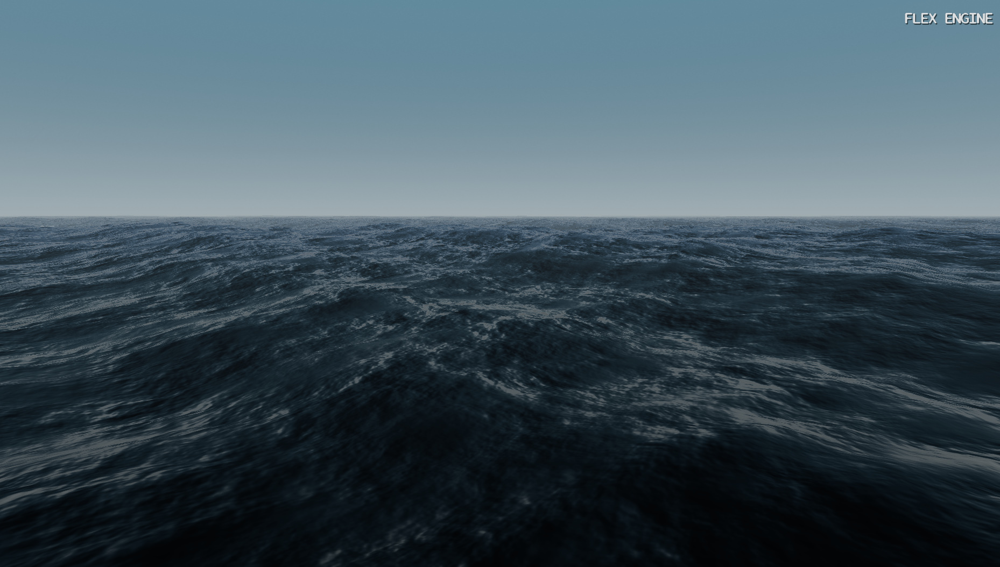
**Gerstner wave ocean simulation**

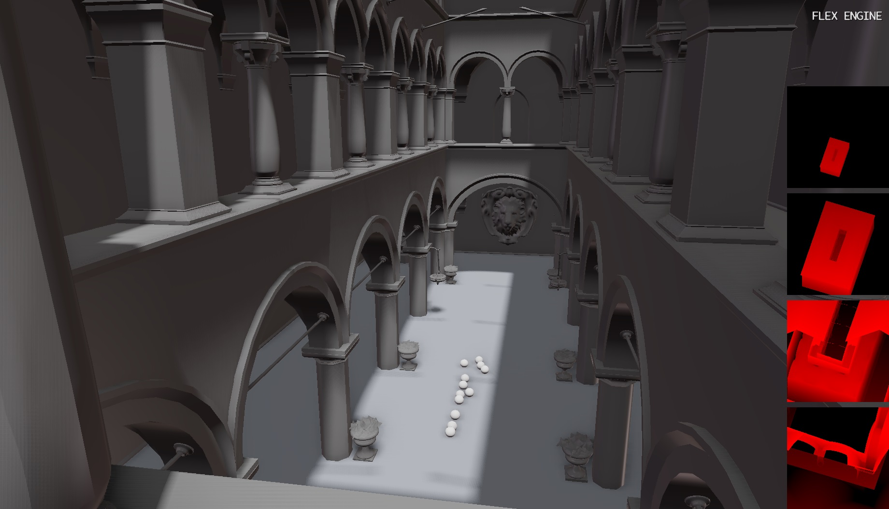
**Cascaded Shadow Mapping**

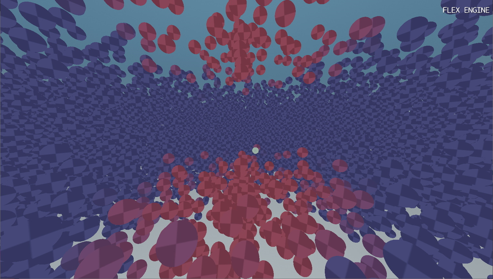
**Two million particles simulated and rendered entirely on the GPU**

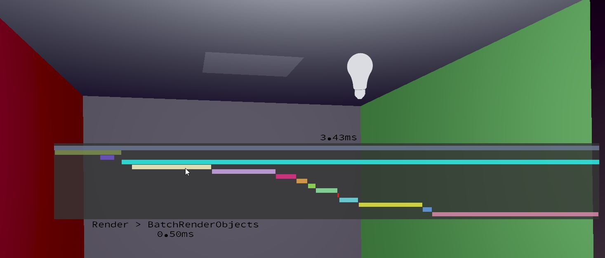
**Profiler overlay showing a breakdown the CPU-time of a single frame**

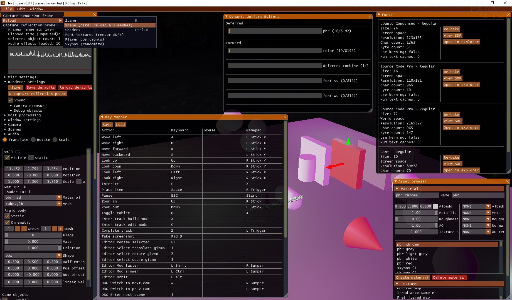
**Some editor windows**

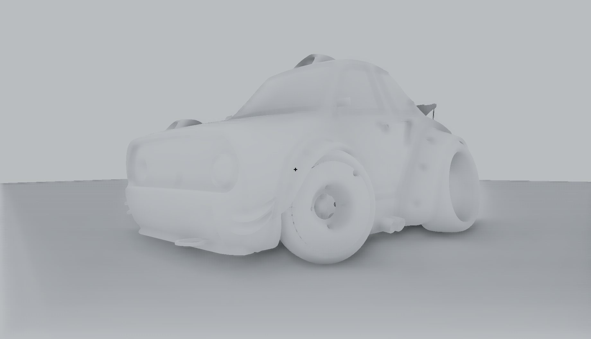
**Screen-Space Ambient Occlusion (SSAO)**

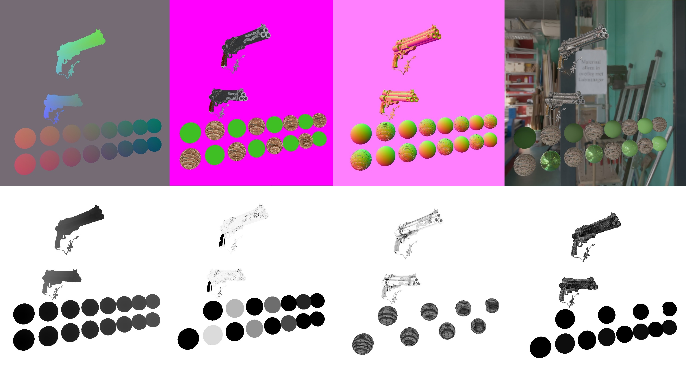
**GBuffer (top-left to bottom-right):** position, albedo, normal, final image, depth, metallic, AO, roughness

**View into editor**

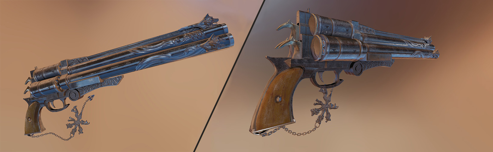

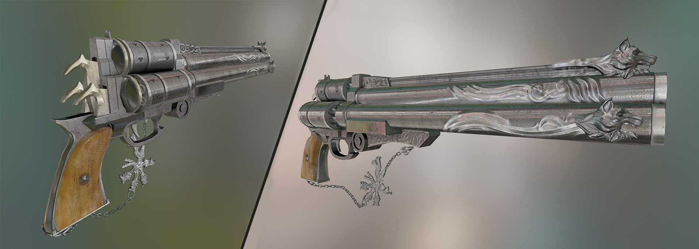

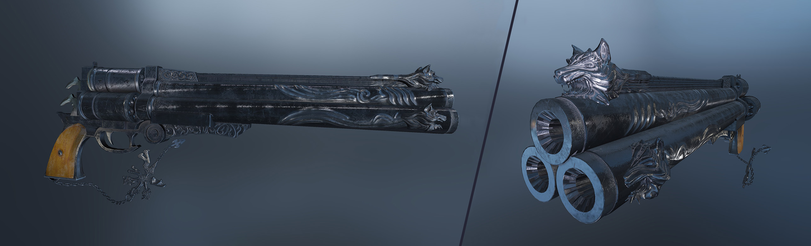

  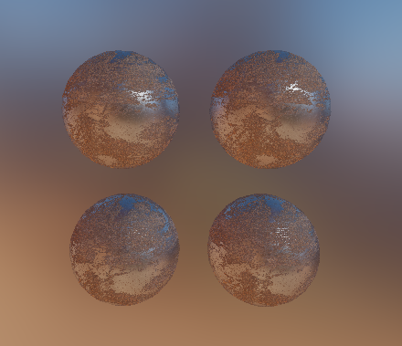
  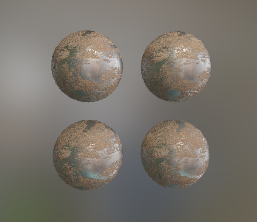

See more screenshots [here](https://github.com/ajweeks/FlexEngine/tree/development/FlexEngine/screenshots)

## Building Flex
See `build.md`

## Dependencies
Flex Engine uses the following open-source libraries:
 - [Bullet](https://github.com/bulletphysics/bullet3) - Collision detection & rigid body simulation
 - [FreeType](https://www.freetype.org/) - Font loading
 - [glfw](https://github.com/glfw/glfw) - Window creation, input handling
 - [glm](https://github.com/g-truc/glm) - Math operations
 - [ImGui](https://github.com/ocornut/imgui) - User interface
 - [OpenAL](https://www.openal.org) - Audio loading and playback
 - [stb](https://github.com/nothings/stb) - Image loading
 - [cgltf](https://github.com/jkuhlmann/cgltf) - Mesh loading
 - [volk](https://github.com/zeux/volk) - Vulkan meta-loader

## License
Flex engine is released under The MIT License. See [license.md](LICENSE.md) for details.

## Acknowledgements
A huge thank you must be given to the following individuals and organizations for their incredibly useful resources:
 - Baldur Karlsson of [github.com/baldurk/renderdoc](https://github.com/baldurk/renderdoc)
 - Alexander Overvoorde of [vulkan-tutorial.com](https://vulkan-tutorial.com)
 - Sascha Willems of [github.com/SaschaWillems/Vulkan](https://github.com/SaschaWillems/Vulkan)
 - Joey de Vries of [learnopengl.com](https://learnopengl.com)
 - Andrew Maximov for the pistol model and textures [artisaverb.info/PBT.html ](http://artisaverb.info/PBT.html)
 - [FreePBR.com](https://FreePBR.com) for the high-quality PBR textures
 - All authors and contributors to the open-source libraries mentioned above

## Blog
 Stay (somewhat) up to date about this project on my blog at [ajweeks.com/blog](https://ajweeks.com/blog/)
